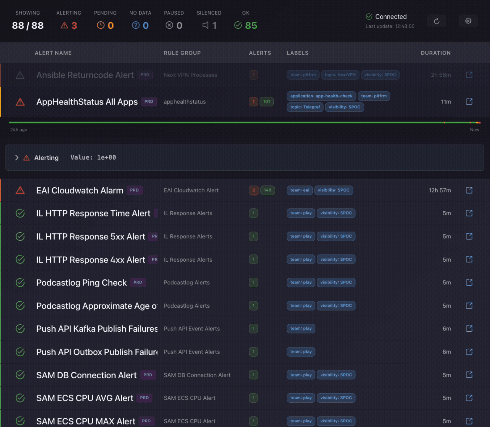

# Grafana Alerts Dashboard

Alternative dashboard for Grafana alerts optimized for wall screen displays. Built with NestJS backend, Vue 3 + Vite frontend, and PrimeVue UI components with real-time WebSocket updates.




## Features

- **Wall Screen Optimized**: Large, clear display designed for monitoring walls
- **Alert Status Visualization**: Color-coded alerts by state (alerting, pending, ok, paused, silenced, no_data)
- **Instance Identification**: Visual and auditory notification of which Grafana instance each alert belongs to
- **Real-time Updates**: WebSocket-based live alert updates from Grafana
- **Multiple Grafana Instances**: Monitor alerts from multiple Grafana instances simultaneously
- **Auto-refresh**: Automatic polling of Grafana API every 30 seconds
- **Responsive Design**: Works on both large displays and regular screens

## Docker Deployment

The application uses **distroless images** for minimal attack surface and smaller image sizes.

### Quick Start with Docker Compose

1. Getting a Grafana API Key

   1. Log in to your Grafana instance
   2. Go to **Configuration** → **API Keys**
   3. Click **Add API key**
   4. Set a name (e.g., "Alerts Dashboard")
   5. Set role to **Viewer**
   6. Set expiration as needed
   7. Click **Add** and copy the generated key

2. **Copy environment file**:
   ```bash
   cp .env.example .env
   ```

3. **Configure Grafana connection** in `.env`:
   
   Single instance:
   ```bash
   GRAFANA_INSTANCES='[{"name":"default","url":"https://grafana.example.com","apiKey":"glsa_xxx"}]'
   ```
   
   Multiple instances:
   ```bash
   GRAFANA_INSTANCES='[{"name":"prod","url":"https://grafana-prod.example.com","apiKey":"glsa_xxx"},{"name":"staging","url":"https://grafana-staging.example.com","apiKey":"glsa_yyy"}]'
   ```
   
   > **Note**: Each alert will display a badge indicating which instance it belongs to (except for instances named "default").

4. **Build and run**:
   ```bash
   docker compose up -d
   ```

5. **Access the dashboard**:
   - Frontend: http://localhost:9999

## Tech Stack

### Backend
- **NestJS** - Progressive Node.js framework
- **WebSocket Gateway** - Real-time bidirectional communication
- **Axios** - HTTP client for Grafana API
- **@nestjs/schedule** - Cron jobs for periodic alert polling

### Frontend
- **Vue 3** - Progressive JavaScript framework (Composition API)
- **Vite** - Next-generation frontend build tool
- **PrimeVue** - Rich UI component library
- **Socket.io Client** - WebSocket client for real-time updates
- **TypeScript** - Type-safe development


## License

MIT

## Support

For issues or questions, please check:
- Grafana API documentation
- NestJS WebSocket documentation
- Vue 3 and PrimeVue documentation
